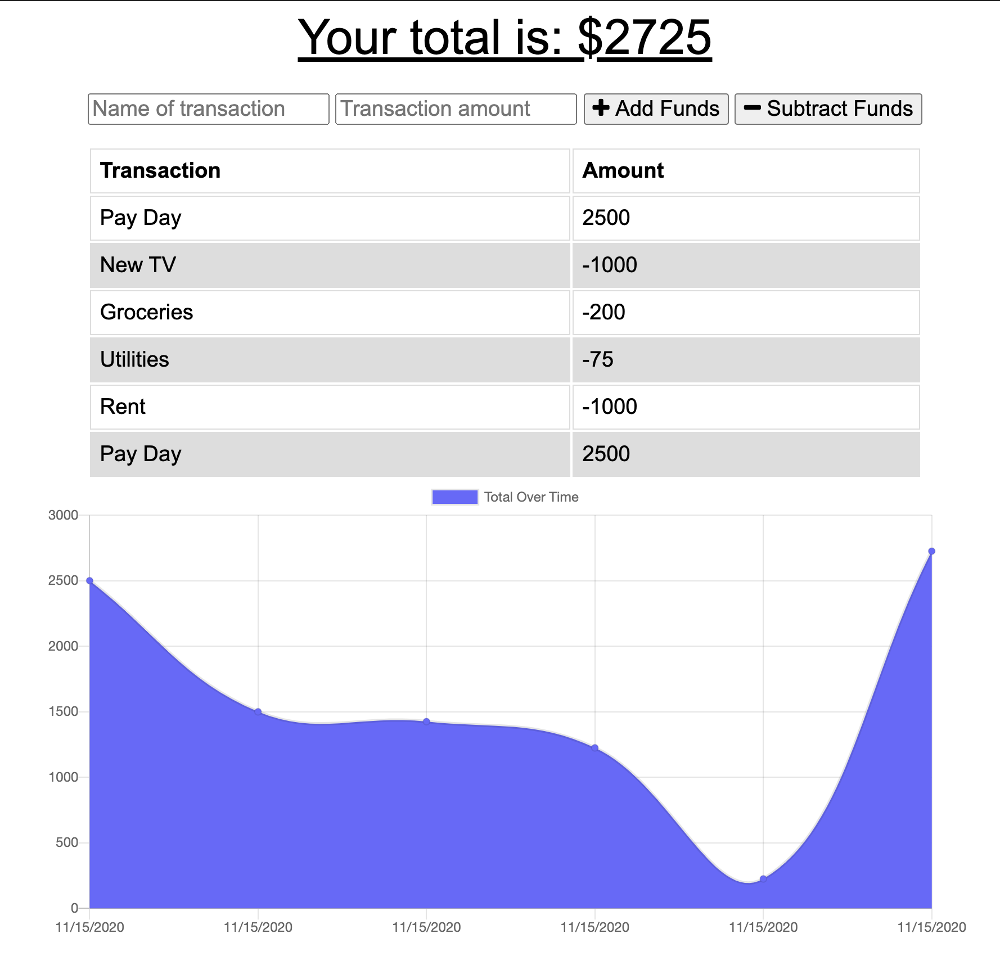

# Budget Tracker

## Deployed

[Access the deployed web application here.](https://budgettracker-ck.herokuapp.com/)

## Purpose

This budget tracking progressive web application is a great way to record and track your deposits and expenses, even when you don't have access to the internet. Any transactions created while the device is offline are saved in IndexedDB, then added to their transaction history once their connection is reestablished.

## Tech

This PWA leverages:

* HTML
* CSS
* JavaScript
* Node.js
* Express.js
* MongoDB
* Mongoose
* IndexedDB
* Chart.js

